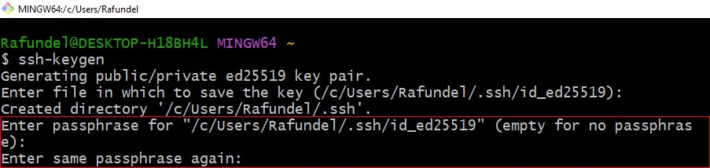
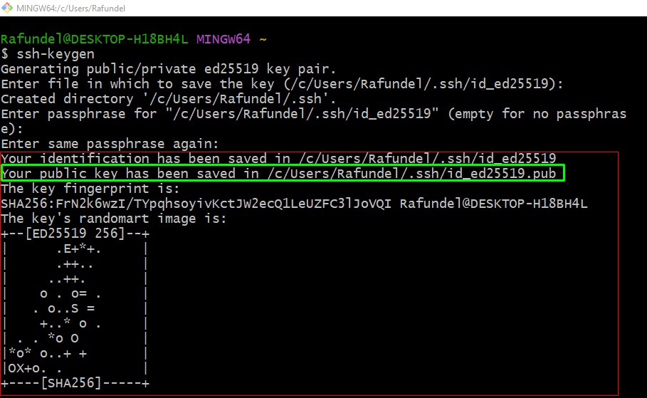
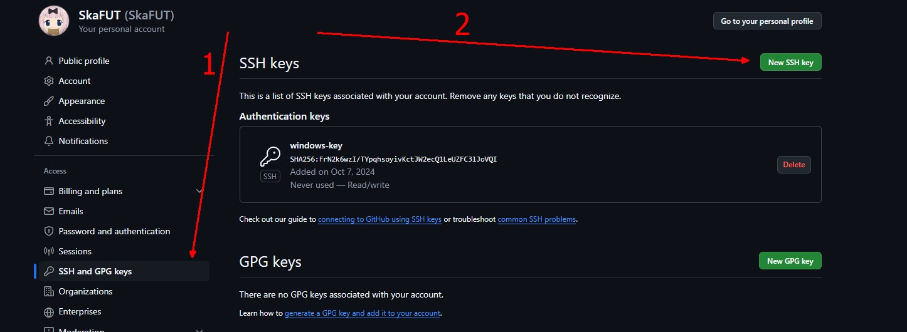
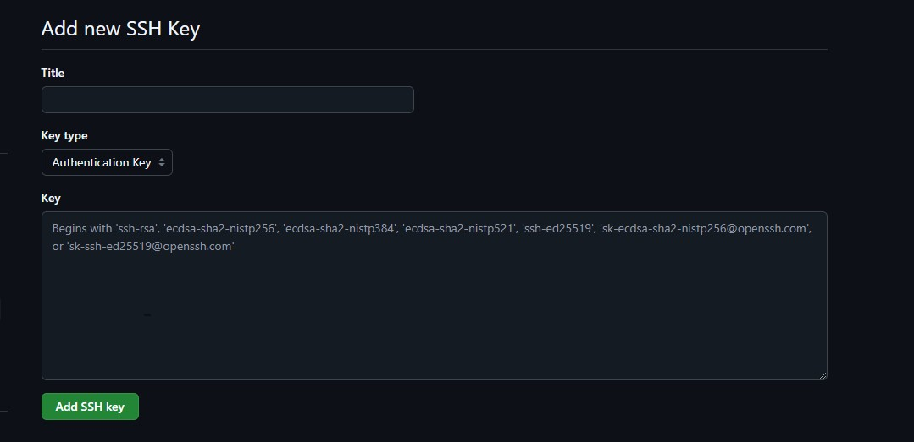
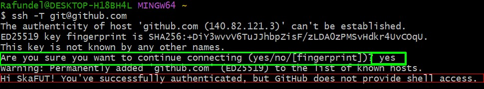

# Тема: Введение и установка Git
## Введение
Git - это **система контроля версий**, которая используется для отслеживания **изменений** в исходных файлах.  

Git позволяет **нескольким участникам** совместно работать над проектом, **отслеживать и сохранять изменения**, а также управлять историей проекта.  

Плюсы использования Git:  
- **История изменений**  
    * Позволяет **откатиться** на любой этап существования проекта(если изменения были **сохранены**).
- **Командная работа**
    * Позволяет удобно и без особых конфликтов **объединять результаты** работы воедино.
- **Ветвление и слияние**
    * Позволяет создавать **несколько веток**, для разных задач(тест нововведений и тд), для того чтобы **не сломать** основную ветку.
- **Безопасность данных**
    * Git хранит данные на удалённом сервере, а также у каждого участника проекта хранится полная копия на локальном устройстве, что позволяет избежать потерь.
***
## Установка
    Для начала нужно убедиться в отсутствии Git на компьютере.
    В командной строке нужно ввести: git --version
***

## Подключение к GitHub, SSH ключ
    Это нужно для того чтобы можно было выгружать локальные репозиторий в удалённые.
    И пользоваться всем функционалом удалённых репозиториев.

1. Открываем **Git bush**
   1. **Вводим** команду `ssh-keygen`  
      * Нас попросят ввести **пароль**(это **не обязательно**)  
        
    2. После чего мы увидим сообщение о том что **ключи были созданы**.
   >_**Зелёным выделено** местонахождения публичного ключа:_  

   

2. После этого переходим по указанному пути на скриншоте выше и **находим файл с расширением _.pub_**, открываем с помощью блокнота и **копируем ключ**.
3. После чего заходим на **[GitHub](http://github.com/)**, потом в **настройки**, далее как на картинке:  
     
   1. В поле **title** вводим название ключа(может быть что угодно)  
   2. В поле **key** вводим ключ
   3. Нажимаем кнопку **Add SSH key**
      
4. Возвращаемся в **Git bush**
   1. Вводим команду `ssh -T git@github.com`.   
   > _**Зелёным выделено** сообщение о **подтверждении** соединения_  
   > _**Красным выделен** результат **успешного** подключения_

   

***
[Оглавление](./../001_markdown/03_menu.md)