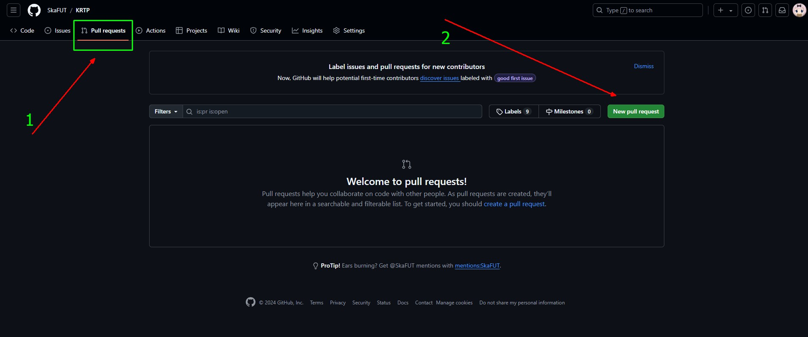

# Тема: Ключевые термины
### 1. Распределённая: 
Git это **распределённая** система управления версиями.  

Распределённая значит, что у каждого участника есть полная копия проекта на устройстве.

***
### 2. Repository(Репозиторий):

**Репозиторий** - это хранилище данных используемое git для отслеживания изменений в файлах проекта.  

- Репозиторий *предоставляет* возможность: 
    - **отслеживать** историю изменений,
    - **создавать** ветки для параллельной разработки,
    - **сливать** воедино изменения
- Также репозиторий содержит **метаданные git** такие как:  
    - История **коммитов**
    - **Теги** 
    - Информацию о **ветках**
    - **Автор**
    - Уникальный идентификатор(**Хеш**)

*__Папка__ - это организованная единица **файловой системы** предназначенная для хранения файлов и поддиректорий*  

    ПАПКА != РЕПОЗИТОРИЙ

    Папка это просто организованная система хранения файлов

    Репозиторий предоставляет возможности эффективной совместной работы и управлением версий(Также он хранится в папке)
***

### 3. Index (Stage):
Представляет собой **промежуточное хранилище** с которым взаимодействует **разработчик**.  

Это файл в котором **содержатся изменения**, подготовленные для **отправки в коммит**.  

***

### 4. Commit (Коммит):
Представляет собой **фиксацию изменений в репозитории**.
Каждый коммит **содержит** информацию о том, что было **изменено**, а также **метаданные**.
***

### 5. Branch (Ветка):
**Отдельные линии разработки**, которые могут включать в себя изменения, **не влияющие на другие ветки**(в частности на основную ветку).  
    
>_Как правило **основную** ветку называют **main**, или в более старых версиях **master**_

    Основная ветка нужна для фиксации изменений основного проекта(чистовик, рабочий вариант).

    А для проверки нововведений, или разработки новых фич, создаётся отдельная ветка.
***

### 6. Clone (Клонирование):
Создание **локальной копии** удалённого репозитория.  
    
    Позволяет работать локально не влияя на удалённый(общий) репозиторий.
***

### 7. Merge (Слияние):
Процесс **объединения изменений** из одной ветки в другую.
***

### 8. Fork (Создание ответвления):
**Создание копии чужого репозитория** на GitHub(Или любой другой хостинг) для **независимой работы** и потенциального вклада в проект.  
>_*После внесения изменения** пользователь может **предложить** автору свои изменения. с помощью **Pull Request**_
***

### 9. Pull Request (Заявка на слияние):
**Запрос на внесение изменений** из одной ветки или репозитория в другую ветку или репозиторий.  

    После отправки pull request заинтересованные стороны рассматривают изменения, обсуждают возможные правки или даже добавляют дополняющие коммиты.

    Так каждый из разработчиков и менеджер проекта видят, что произошло с кодом после совместной работы над коммитом.

>_Я задался вопросом **почему команда заявки на слияние** называется **Pull Request**, а не **Push Request**.  По аналогии с **Pull** и **Push**._   

Если у вас есть изменение кода в вашем репозитории, и вы хотите переместить его в целевой репозиторий, то:

- **«Push»** - это когда вы заставляете изменения присутствовать в целевом репозитории (git push).
- **«Pull»** - это захват целевым репозиторием ваших изменений, чтобы они присутствовали в нём (git pull).  
- **«pull request»** - это ваша просьба к целевому хранилищу взять ваши изменения.  
- **«push request»** означает, что целевой репозиторий просит вас выложить свои изменения.  

>*Вот такой ответ я получил на просторах интернета, ну и выходит логично, **push** - это **полное решение разработчика**, а **pull** - это как бы **репозиторий забирает наши изменения** и тем самым **pull request**, это **мы просим репозиторий** взять наши изменения.*

#### 9.1 Алгоритм добавления
После того как мы Форкнули чужой репозиторий и внесли в него изменения, мы скорее всего захотим предложить автору рассмотреть наши нововведения.
Для этого нам потребуется:
1. Зайти в GItHub на форкнутый репозиторий
2. 
***

### 10. Checkout (ответвление):
Команда **git checkout** используется для **проверки нужного состояния вашего репозитория**, будь то **ветка** или конкретный **файл**, а также позволяет создавать и **перемещаться** по веткам.  

**Команда git checkout** – это один из самых простых методов **отката изменений** в GIT.  

    Представим, что вы внесли изменения в файл, но еще не добавили их в индекс. Просто введите команду, укажите имя файла, изменения которого вы хотите отменить: 
    git checkout myfile.txt Git Reset.

**У git checkout есть 3 варианта использования:**  
1. Для **создания** новой ветки из текущей.  
2. Для **переключения** между существующими локальными ветками.  
3. Для **проверки и перехода к определенному статусу** конкретного файла.
***

### 11. Tracking (Отслеживание):
Отслеживание файлов означает, что они **добавлены в индекс** и будут **включены в следующий коммит.**
***

### 12. Untracking (Не отслеживание):
Не отслеживаимые файлы означают, что они **_НЕ БЫЛИ_ добавлены в индекс** и _**НЕ**_ будут **включены в index и _НЕ_ находятся под контролем git.**
***

### 13. Merge Conflict:
Конфликт, который происходит, когда **две ветки** имеют **изменения в одних и тех же строках кода.** 
***

## 14. Родительский коммит:
**Каждый коммит**, кроме первого, имеет родителя - **родительский коммит.**  

    Родительский коммит содержит хеш-ссылку на предыдущий коммит.
***

## 15. Working Directory(Рабочий каталог/директория)
Репозиторием является именно директория .git. Она хранит **всю информацию о том, какие были изменения, а также сами изменения**.

А вот все, что **находится снаружи**, это так называемая *рабочая директория* (working directory). **Эти файлы извлекаются из .git в момент клонирования.**

Каждый раз, когда мы производим изменения в рабочей директории, **Git сравнивает измененные файлы с файлами внутри .git**, то есть их состоянием на момент **последнего коммита**. Если есть изменения относительно последней зафиксированной версии, то Git сообщает нам об этом в выводе команды **[git status](03_gitComands.md)**.  
***
# Термины в консоли
## insertions(+)
    Это количество строк которые были добавлены в этом коммите.
## deletions(-)
    Это количество строк удалённых в этом коммите.
***
## Буквенные обозначения в боковой панели(Explorer)
### [U (Untracked)](./03_gitComands.md "git status Пункт 2")
### [A (Added)](./03_gitComands.md "git status Пункт 1.2")
### [M (Modify)](./03_gitComands.md "git status Пункт 1.1")
***
[[GIT|Оглавление]]