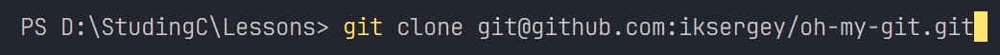

# Тема: Команды Git
### 1. git init
    Данная команда инициализирует новый Git-репозиторий.

**После выполнения** этой команды **в папке с нашим проектом**, git **создаёт скрытую подпапку .git, содержащую все необходимые данные** и структуру данных для отслеживания изменений в нашем проекте, а также наша папка **будет считаться git-репозиторием.**  
В этой папке git **хранит информацию о коммитах, ветках и др.**  
***

### 2. git status
    Информация о текущем состоянии репозитория
Во время выполнения этой команды git выводит список файлов которые были изменены в рамках нашего репозитория(удалены, модифицированы, добавлены), также выводит их статус (отслеживаемые, не отслеживаемые), а также текущую ветку проекта.
***
    В git файлы могут находится в 3 основных состояниях

    
1. [Tracked](02_termins.md "Пункт №11")
   1. Modified
      - Файлы, которые были изменены в рабочем каталоге, но ещё не были зафиксированы(закоммичены) в репозиторий.
   2. Staged(Added)
      - Изменённые файлы, которые были добавлены в [index](02_termins.md "Пункт №3") и ожидают коммита.
   3. Commited 
      - Файлы, изменения в котором были сохранены в репозиторий.
2. [Untracked](02_termins.md "Пункт №12")
***
### 3. git add
    Данная команда служит для явного добавления файла в index 
**git add** - Добавление **всех изменений** в index.  

**git add fileName** - Добавление **файла** в index.  

**git add -p**(сокращённо от git add --patch) - **Интерактивное добавление в индекс**, git выводит все сделанные изменения в коде и **вам остаётся выбрать** что нужно индексировать, а что нет.  
***

### 4. git commit
Используется для сохранения изменений в репозиторий.
>_Именно благодаря этой команде мы можем отслеживать историю проекта и все изменения, которые когда либо были сделаны._

    Пример:  
    git commit -m "Описание коммита"
#### 4.1 Порядок выполнения команд для коммита

Как мы видим пок картинке выше, для того чтобы что либо закоммтеть, нужно чтобы это было в [STAGE(Index)](02_termins), а для этого выполняем команду `git add filename` и только потом `git commit -m "Описание"`

#### 4.2 Структура коммита
  
Каждый коммит содержит в себе опреедлённые ключевые элементы:
- **Хеш**(Уникальный идентификатор коммита, содержащий в себе последовательность из символов)
- **Автор и email**
- **Дата и время**
- **Сообщение коммита**(Не забывать оставлять)  
#### 4.3 git show HEAD^
Указатель на **предыдущий** коммит: **git show HEAD^**
***
### 5. git log
Данная команда **показывает историю** коммитов ***от последнего к первому***.

>_Выводит только для **текущей** ветки_

#### 5.1 Флаги git log
1. git log --oneline
   - Вывод коммит на одной строке.(Только хеш и первую строку сообщения коммита)
2. git log --graph
   - Рисует ASCII-граф истории коммитов, показывая ветвления и слияния.
3. git log --all
   - Выводит все доступные коммиты в репозитории со всех веток.  
***

Можно комбинировать флаги и написать вот так:

`git log --oneline --graph -- all`  
Данная команда вводит **все коммиты**, каждый на **одной строке** и **рисует ASCII-граф.**
***
### 6. [git checkout](02_termins.md)
Используется для:  
* __переключения__ между ветками,  
* __восстановления файлов__ из индекса или рабочего каталога  
* создания __новых__ веток

Примеры сценариев использования:
1. `git checkout -- FileName.txt` это откат  изменений до последнего коммита
2. `git checkout хеш_коммита` переключение на определённый коммит(показывает проект предшествующий указанному коммиту)
>[!TIPS]
>_Хеш можно указывать не полностью, а сокращённую версию_
3. `git checkout имя_ветки` переключение между ветками
4. `git checkout -b имя_новой_ветки` Создаёт новую ветку и переключается на неё
***
	Также рекомендуют вместо git checkout, использовать другие команды, для большей понятности

>_Для того чтобы **вернуться к последнему коммиту** какой либо ветки, нужно прописать `git checkout имя_ветки`_

### 7. git switch
Служит для  
- Переключения на другие ветки  
   - `git switch имя_ветки`
- Создания новых веток и переключения на них  
   - `git switch -c имя_новой_ветки`
- Переключения на определённый коммит
   - `git switch -d хеш_коммита`  
***
    ВАЖНО!
    Перед переключением на другие ветки, нужно коммитеть изменения сделанные на данной ветке!!!!
***
### 8. git restore
Служит для: 
- восстановления файлов из index  
   - `git restore --staged файл.txt`
- восстановления файлов из предыдущего коммита  
   - `git restore файл.txt`
***

### 9. git branch
    Команда позволяет работать с ветками в репозитории.  
#### 9.1 Флаги `git branch`:
1. `git branch` - **Показывает все** ветки в репозитории.  
2. `git branch Имя_Ветки` - **Создаёт _новую_ ветку** под названием(Имя_Ветки), но не переключает на неё.  
3. `git branch -d Имя_ветки` - **Удаление ветки** с именем Имя_ветки(если она была слита с другими ветками([merge](02_termins.md)))  
   1. `git branch -D Имя_Ветки` - **Удаление ветки** с именем Имя_ветки **ДАЖЕ** если она **НЕ** была слита с **другими** ветками.  
4. `git branch -m Новое_Имя_Ветки` - **Переименовывает текущую ветку** в Новое_Имя_Ветки, если ветка с Новое_Имя_Ветки **уже существует**, она **_НЕ_** будет перезаписана, а также выдаст сообщение об ошибке.
   1. `git branch -M Новое_Имя_Ветки` - **Переименовывает текущую ветку** в Новое_Имя_Ветки, если ветка с Новое_Имя_Ветки **уже существует**, она **будет перезаписана** новыми данными без каких-либо дополнительных запросов ли подтверждений.
***

### 10. git merge
Данная команда используется для **объединения изменений из одной ветки в другую**. Обычно это делается для включения изменений из одной ветки в целевую ветку.

Порядок выполнения команды:
1. Нужно переключится на ветку в **КОТОРУЮ** мы хотим внести изменения  
   * `git checkout имя_целевой_ветки`  
2. Потом выполняем команду **git merge имя_ветки**(Из которой хотим слить изменения)  
   * `git merge имя_ветки(Из которой хотим слить изменения)`
3. **Фиксируем** изменения.
   * `git commit -m "Описание изменений"`  

#### 10.1 merge conflict
    После разрешения конфликта нужно обязательно закоммитеть, иначе merge будет не закончен

### 11. [git clone](02_termins.md)
Для того чтобы произвести клонирование репозитория необходимо:  
 
1. Нажать на кнопку **Code**
2. Выбрать тот путь по **которому устанавливалось соединение**
3. **Скопировать** строчку  

  
4. **Открыть терминал и прописать** `git clone строчка_из_пункта_3`

***

### 12. git pull
Данная команда, извлекает изменения из удалённого репозитория и автоматически объединяет их с текущей веткой.  
`git pull`  
***
### 13. git push
Данная команда, передаёт в удалённый репозиторий изменения, сделанные в локальном репозитории.  
`git push`  
***

***
[[GIT|Оглавление]]