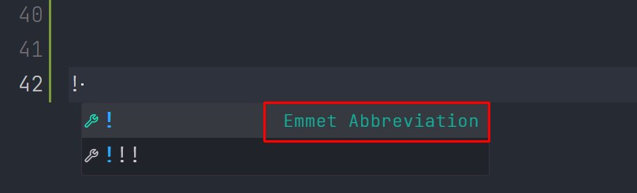

# Тема: Шаблон
## Базовая структура шаблона
Ниже представлен **пример** базового шаблона, **обязательного минимума**
```HTML
<!DOCTYPE html> - указание версии html
<html lang="ru">
    <head> - раздел заголовков
        <meta ........>
        <meta ........>
        <meta ........>
        <title>Заголовок</title>
        <link rel="stylesheet" href="style.css"> - файл css
        <script>
                1 вариант - тогда код подгрузится при открытие сайта.
        </script>
    </head>
    <body> - раздел в котором содержится весь контент
        <script>
            2 вариант - тогда скрипт загрузится в тот момент где будет располагаться в коде.
        </script>

    </body>
    <script>
        3 вариант - Тогда скрипт загрузится после разметки.
    </script>
</html>
```
    Для того чтобы не вводить весь шаблон руками, нам достаточно написать ! знак и Emmet И VSCode должен нам помочь. 

    Ниже представлен скриншот того как это выглядит


> _Результат ввода `!` и **принятия подсказки Emmet**_
```HTML
<!DOCTYPE html>
<html lang="en">
<head>
  <meta charset="UTF-8">
  <meta name="viewport" content="width=device-width, initial-scale=1.0">
  <title>Document</title>
</head>
<body>
  
</body>
</html>
```

***
[Оглавление](./../001_markdown/03_menu.md)