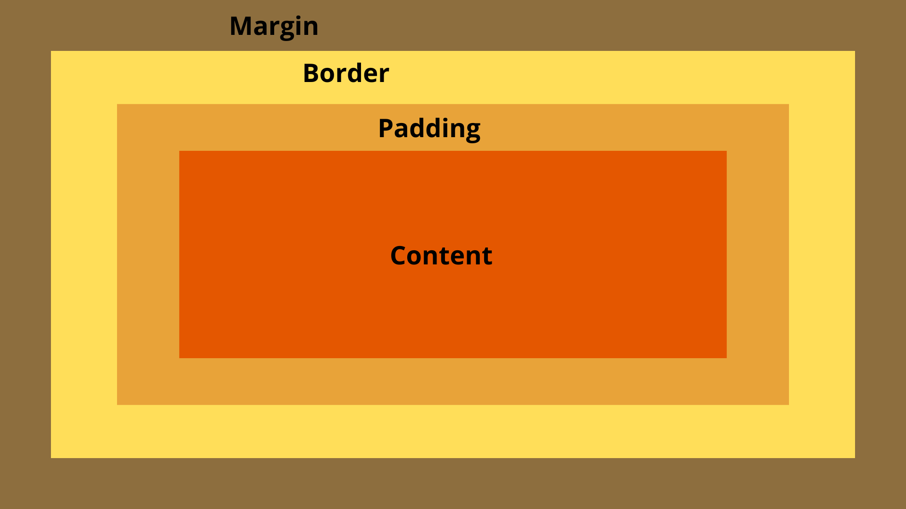

# Тема: Термины CSS
## 1. Способы подключения
Приоритет применения CSS:
1. Inline Styles  
2. Internal Styles  
3. External Styles  
>_Данный приоритет важен если будет **конфликт стилей**(допустим есть **External файл** и **Inline прописано для тега `<p>`**), тогда будет **использоваться inline** так как по приоритету он **выше**, так как более специфичен._
### 1.1 Inline Styles
Особенностью такого метода подключения является, то что CSS код встраивается **непосредственно в теги элементов** с помощью атрибута `style=""`
```HTML
<p style="font-size:20px; color: brown;">
    TExt TExt
</p>
```
Данный способ может привести к тому что наш код будет **менее читабельным и усложнить поддержку сайта**, так как стили будут разбросаны по всему HTML-документу.
***

### 1.2 Internal Styles
Данный способ подключения **добавляется внутрь тега** [`<style></style>`](../003_html/03_Tags.md), который обычно располагается в **теле** тега [`<head>`](../003_html/03_Tags.md).  
>_**Плюсом** использования этого способа является то что мы можем **применить CSS ко всем элементам на странице.**_  

    Является хорошим выбором когда стили специфичны только для ОДНОЙ страницы сайта.

```HTML
<head>
    <style>
        h1{
            color: green;
            font-size: 24px;
        }
        p{
            color: blue;
        }
    </style>
</head>
<body>
    <h1>Заголовок1</h1>
    <p>Текст 1</p>
    <h1>Заголовок2</h1>
    <p>Текст 2</p>
</body>
```
***

### 1.3 External Styles(Чаще всего используют)
Суть способа заключается в том что **создаётся отдельный файл .css**, который затем **подключается** к HTML с помощью **тега [`<link>`](../003_html/03_Tags.md)**

    Преимуществом данного способа является централизованно управлять стилями для множества страниц, намного упрощая поддержку сайта.

```CSS
Файл .css
h1{
    color: green;
    font-size: 24px;
}
p{
    color: blue;
}
```

```HTML
Файл .html
<head>
    <link rel="stylesheet" href="style.css">
</head>    
```
***
## 2. Модели поведения элементов
Веб-страницы состоят из **блоков:**
1. **Строчные** 
2. **Блочные**
3. **Строчно-блочные**
4. ****
5. ****
***
### 2.1 Строчные элементы (Inline)
>[!IMPORTANT]
>_Строчные элементы занимают **ровно столько** места **сколько им необходимо**._  

**Примеры**:
- **span**
- **a**
- **b**
- **strong**
- **и тд**  

      1.Они игнорируют свойства ширины и высоты  
      2.Нельзя установить верхний и нижний отступы
***
#### 2.1.1 Управление строчными элементами  


***
### 2.2 Блочные элементы (Block-level)
[!IMPORTANT]
>_Блочные элементы занимают **всю доступную ширину**._  

**Примеры**:
- **p**
- **h1-h6**
- **ul**
- **div**
- **и тд**  

      1.Они принимают свойства ширины и высоты  
      2.Можно устанавливать верхний и нижний отступы, границы и поля

#### 2.2.1 Управление блочными элементами  
  
- **Margin** - Отступы между блоками   
- **Border** - Рамка   
- **Padding** - Внутренние отступы   
- **Content** - Контент   
***
##### 2.2.1.1 Padding
Padding ограждает контент от границы
```CSS
.content{
    padding: 20px; /*Означает что с каждой из сторон отступ будет 20px*/

    padding-top: 20px;/*Отступ сверху*/
    padding-right: 20px;/*Отступ справа*/
    padding-bottom: 20px;/*Отступ снизу*/
    padding-left: 20px;/*Отступ слева*/
    
    padding: 20px 10px;/*Отступ сверху и снизу по 20px, а слева и справа по 10px*/
    padding: 20px 10pt 5em 1%;/*Отступы сверху, справа, снизу и слева соответственно*/
}
```
>[!TIPS]
>_Также могут принимать отрицательные значения, но для padding это не актуально(редко используется)_
##### 2.2.1.2 Margin
Margin ограждает сами блоки друг от друга
```CSS
.content{
    margin: 20px; /*Означает что с каждой из сторон отступ будет 20px*/

    margin-top: 20px;/*Отступ сверху*/
    margin-right: 20px;/*Отступ справа*/
    margin-bottom: 20px;/*Отступ снизу*/
    margin-left: 20px;/*Отступ слева*/
    
    margin: 20px 10px;/*Отступ сверху и снизу по 20px, а слева и справа по 10px*/
    margin: 20px 10pt 5em 1%;/*Отступы сверху, справа, снизу и слева соответственно*/
}
```
>[!TIPS]
>_Также могут принимать отрицательные значения_
##### 2.2.1.3 border
Рамка вокруг контента.  
border-style:
- solid (монолит),
- dashed (штрих),
- dotted (пунктир),
- double (2 параллельные линии)
- groove (Рамка)
- hidden (Невидимая)
- inset (двойная тёмно/светлая)
-   

```CSS
.content{
    border-width: 10px;/*Толщина рамки*/
    border-style: solid;/*То как будет выглядеть рамка*/
    border-color: red;/*Цвет рамки*/

    border: 10px solid red;/*Эквивалент вышенаписанному*/
}
```
***

***
[Оглавление](./../001_markdown/03_menu.md)